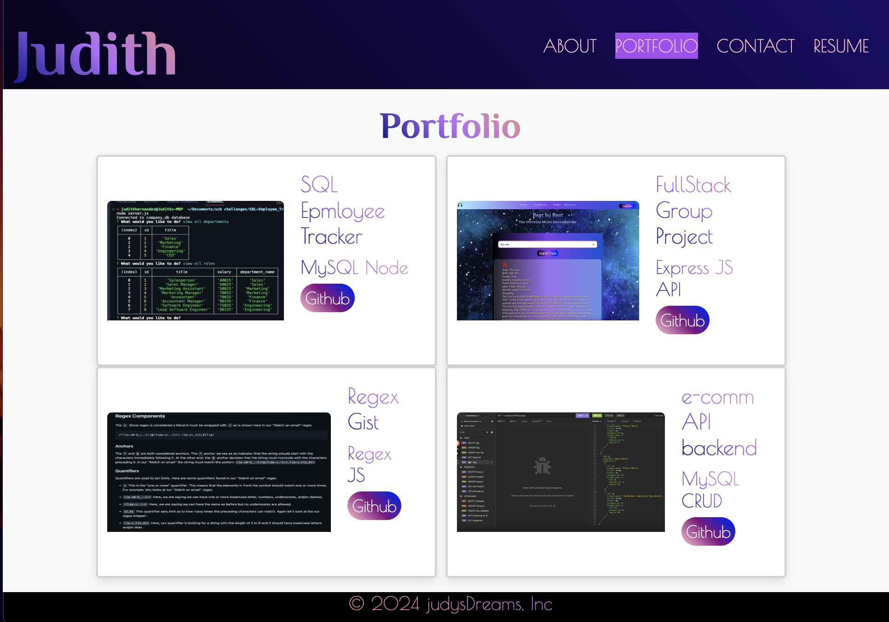

# React + Vite Portfolio in Netlify

## Description

This React App was made with Vite. This was made for future employers and collaborators. It contains a short description about me, a few projects I've worked on, my resume, and how to contact me.

## Table of Contents

- [Installation](#installation)
- [Usage](#usage)
- [License](#license)
- [Contributing](#contributing)
- [Questions](#questions)

## Installation

This React App was deployed with Netlify. There is nothing to install, simply visit the link given in Usage.

## Usage

My React Portfolio is an already deployed website. If you want to learn more about my work simply click on this link:
https://main--incandescent-fairy-53fa94.netlify.app/

## License

This project is licensed under the [mit](https://opensource.org/licenses/MIT) license.

## Contributing

If you would like to contribute, you can find this repo at [judy-her](https://github.com/judy-her)

## Questions

For questions about the repo, feel free to email me Judith Hernandez at judith85dm@ucla.edu
